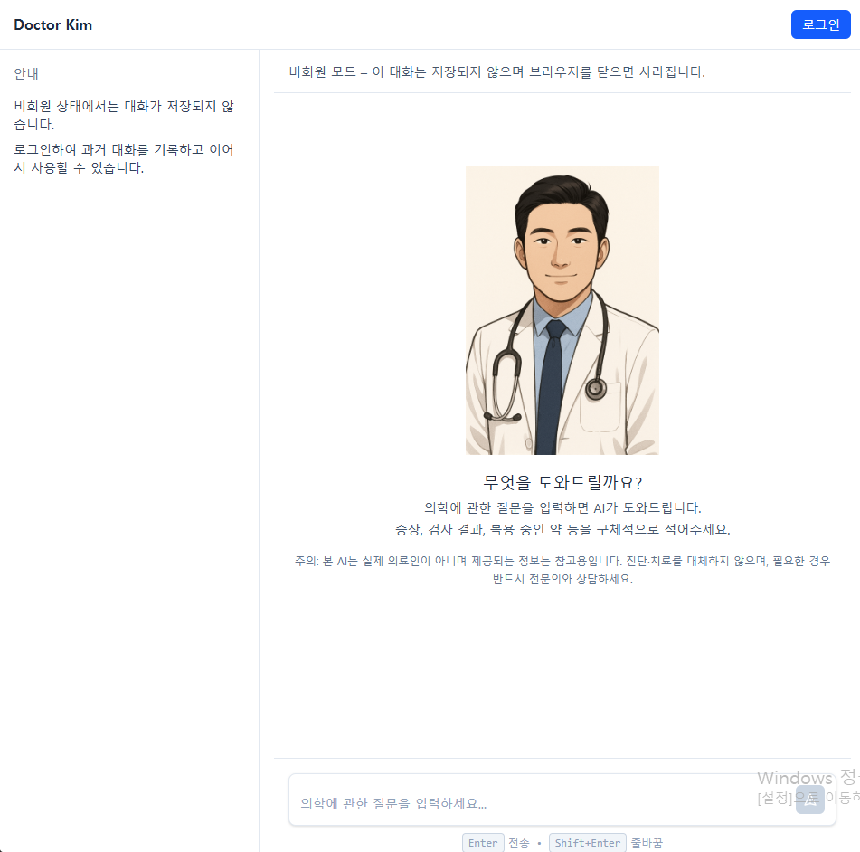
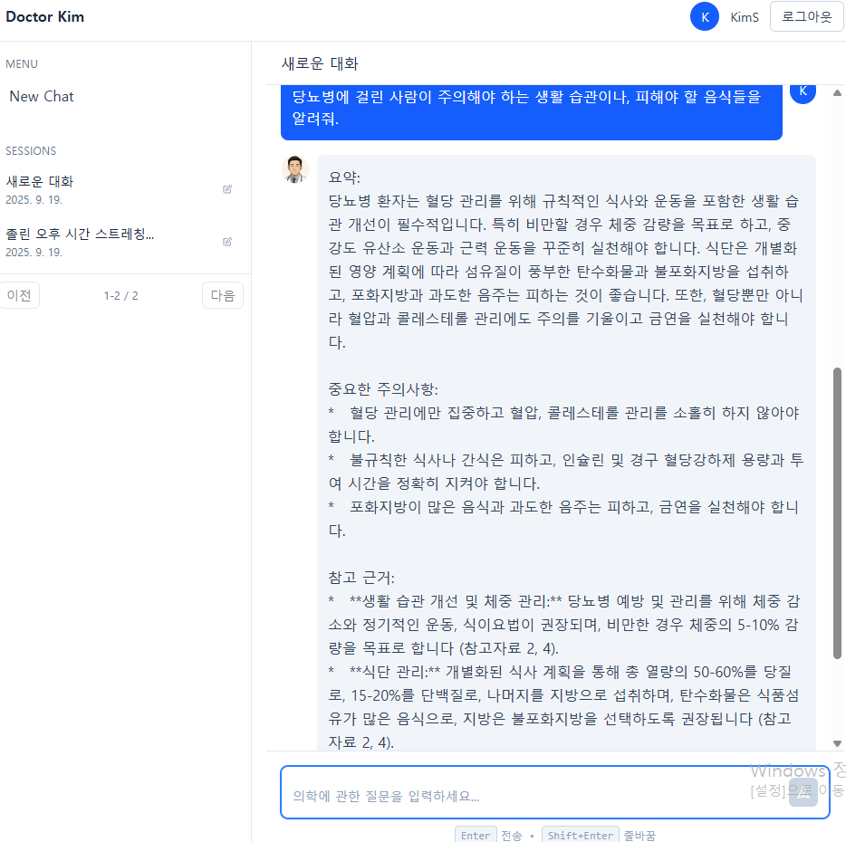
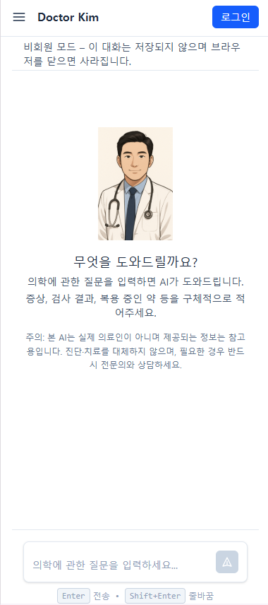
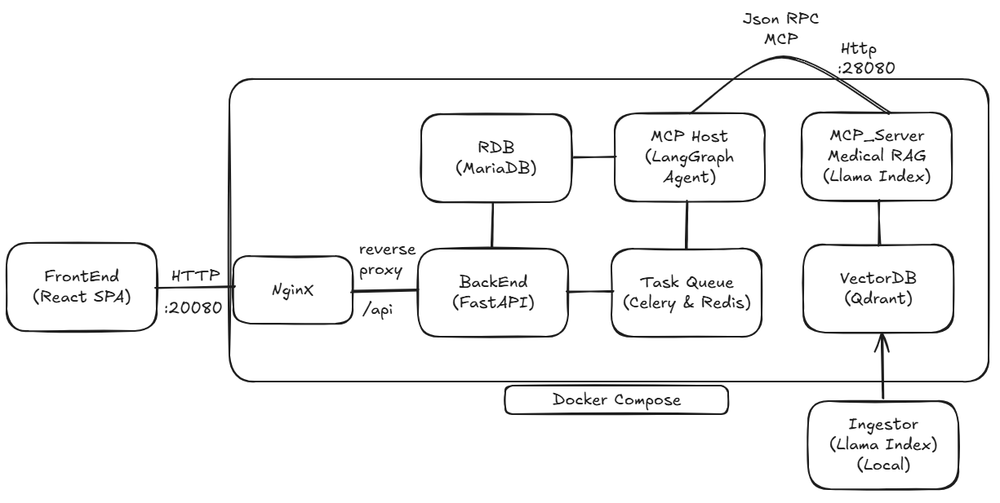

# Doctor Kim — 의료 RAG 챗봇 프로토타입 (회고 문서)

> **Note**: 이 프로젝트의 소스 코드는 이전 인턴 기간 중 작성되어 비공개입니다.
> 본 레포는 프로젝트의 아키텍처, 기술적 의사결정, 그리고 개발 과정에서 부딪힌
> 문제들에 대한 회고 문서입니다.

---

## 📜 프로젝트 개요

**Doctor Kim**은 공공 의료 데이터(AI Hub)를 벡터 DB에 적재하고, LangGraph 기반
에이전트가 상황에 따라 RAG 도구를 호출해 사용자의 의료 관련 질문에 답하는
**의료 상담 챗봇 프로토타입**입니다.

백엔드(FastAPI), 프론트엔드(React), 벡터 DB(Qdrant), 메시지 큐(Celery/Redis),
MCP 기반 RAG 서버까지 전 구성 요소를 **1인이 설계·구현**했고, Docker Compose로
하나의 명령어로 전체 시스템을 배포할 수 있게 구성했습니다.

- **작업 기간**: 2025.07 ~ 2025.09 (약 3개월)
- **상태**: 프로토타입 단계. 프로덕션 수준 서비스로 발전시키지 못하고 중단.
- **역할**: 기획, 설계, 구현, 배포 전 과정 단독 수행

이 README는 프로젝트 소개와 함께 **개발 과정에서 마주친 한계와 그로부터 얻은
교훈**을 함께 정리한 기술 회고 문서입니다.

---

## 🖼️ 실행 화면

### 메인 화면



비회원 모드와 회원 모드를 지원합니다. 비회원 모드에서는 대화가 저장되지 않고
브라우저를 닫으면 사라지며, 회원으로 로그인하면 대화 히스토리가 데이터베이스에
저장되어 이전 대화를 이어갈 수 있습니다.

### 대화 예시



LangGraph 에이전트가 사용자 질문을 받아 의료 지식 검색이 필요한지 판단하고,
필요할 경우 MCP 기반 RAG 서버에 도구 호출을 수행합니다. 검색 결과를 바탕으로
LLM이 **요약 → 중요한 주의사항 → 참고 근거** 순으로 구조화된 답변을 생성하며,
참고 근거에는 검색된 문서의 출처가 함께 표기됩니다.

### 모바일 대응



반응형 레이아웃으로 설계되어 모바일 환경에서도 동일하게 동작합니다.

---

## 🏛️ 시스템 아키텍처



Docker Compose 위에서 다음 서비스들이 독립 컨테이너로 실행됩니다:

| 컴포넌트 | 역할 |
|---------|------|
| **Frontend** (React SPA) | Vite로 빌드된 정적 파일 |
| **Nginx** | 리버스 프록시. `/` 는 프론트엔드로, `/api` 는 백엔드로 라우팅 |
| **Backend** (FastAPI) | JWT 기반 사용자 인증, AI 서비스 호출 창구, RDB와 통신 |
| **Task Queue** (Celery + Redis) | 백엔드와 AI 에이전트 사이의 비동기 작업 큐 |
| **MCP Host** (LangGraph Agent) | 대화 상태 관리와 RAG 도구 호출 여부 판단 |
| **MCP Server** (LlamaIndex) | MCP(JSON-RPC)로 노출된 RAG 서버 |
| **VectorDB** (Qdrant) | 의료 데이터 임베딩 저장소 |
| **RDB** (MariaDB) | 사용자 정보와 대화 히스토리 저장 |
| **Ingestor** (로컬 실행) | 원본 데이터를 임베딩해 Qdrant에 적재하는 배치 스크립트 |

MCP Host와 MCP Server 사이는 **JSON-RPC 기반 MCP(Model Context Protocol)** 로
통신합니다. 향후 다른 도구 서버를 추가하거나 에이전트를 교체할 때 결합도를
낮추기 위한 설계 선택이었습니다.

---

## 🛠️ 기술 스택

| 레이어 | 사용 기술 |
|--------|----------|
| Frontend | React 19, TypeScript, Zustand, Vite |
| Backend | Python 3.11, FastAPI, SQLAlchemy, Uvicorn |
| AI / Agent | LangGraph, LlamaIndex, MCP (JSON-RPC) |
| Task Queue | Celery, Redis |
| Database | MariaDB, Qdrant |
| DevOps | Docker, Docker Compose, Nginx |

---

## 💡 주요 설계 결정

### 1. MSA 지향과 Docker Compose

각 기능(백엔드, 프론트엔드, RAG, 에이전트)을 독립 컨테이너로 분리하고,
`docker-compose.yml` 하나로 전체 시스템을 기동하도록 구성했습니다. 단일 서버에서도
배포 스크립트 한 줄로 전체 시스템을 재구성할 수 있게 했고, 개발 중 특정 서비스만
재시작해 디버깅할 수 있게 했습니다.

### 2. MCP 프로토콜 채택

RAG 서버를 일반 REST API가 아닌 **MCP(Model Context Protocol)** 기반으로
노출했습니다. MCP는 LLM 에이전트가 외부 도구를 호출하기 위한 표준 프로토콜로,
JSON-RPC 포맷을 따릅니다. 이렇게 설계한 이유는 나중에 LangGraph 에이전트를
다른 LLM 오케스트레이션 프레임워크로 교체하거나 다른 도구 서버를 추가할 때
결합도를 낮추기 위함이었습니다.

### 3. LangGraph를 통한 상태 기반 대화 흐름

단순 QA가 아닌 대화 맥락을 유지하는 챗봇이 목표였기 때문에 LangGraph를 도입해
대화 상태를 그래프 노드로 관리했습니다. 사용자 질문이 단순 대화인지(의료 지식
검색이 필요 없음) 전문 지식 조회가 필요한지(RAG 도구 호출 필요)를 에이전트가
분기하도록 구성했습니다.

### 4. 세션 저장소 분리 (MariaDB 기반)

LangGraph 체크포인터로 기본 제공되는 인메모리 저장소 대신 MariaDB 기반의 커스텀
`SessionStore`를 구현해 연결했습니다. 이렇게 한 이유는 (a) 워커 재시작 시 대화
히스토리가 유실되지 않도록 하고, (b) 여러 사용자의 세션을 영속적으로 관리하기
위함이었습니다.

---

## 🔍 회고 및 한계 (Lessons Learned)

이 프로젝트는 대부분의 구성 요소가 동작하는 수준까지 완성되었지만, 운영 수준
서비스로 발전시키기에는 명확한 한계를 만났습니다. 이 섹션은 그 한계를 구조적으로
정리한 기술 회고입니다.

### 1. 도메인 선택의 실패 — 비전문 영역에서 RAG를 시도한 대가

본 프로젝트는 의료 도메인을 선택했지만, 개발자 본인은 의료 비전문가였습니다.
공공 의료 데이터로 AI Hub의 데이터셋을 확보했으나, 실제로 사용 가능했던 데이터는
"문진-진단" 페어 500쌍, 의료 교과서 부분 발췌본 수준으로 매우 제한적이었습니다. 벡터 DB에 적재해도
사용자의 자연어 질문에 충분한 밀도로 답변하기 어려운 규모였습니다.

처음에는 "데이터가 부족하면 더 찾으면 되겠지"라고 생각했지만, 실제로는 **의료
도메인의 공공 데이터를 비전문가가 평가하고 정제하는 것 자체가 불가능**했습니다.
어떤 데이터가 임상적으로 유의미한지, 어떤 용어가 환자 질문과 매핑되는지 판단할
수 있는 기준이 저에게 없었기 때문입니다.

개선을 위해 표준 의료 용어 체계인 **SNOMED CT**(국제 표준) 및 한국보건의료정보원
(HINS)의 관련 데이터셋을 확보하려 시도했습니다. 국제 SNOMED CT 라이선스는 기관
소속 증빙과 연구 목적 심사를 통과하지 못해 반려되었고, 국내 경로를 통한 신청도
요건 보완 요청이 반복되는 과정에서 제가 기술 개발에 몰두하느라 회신을 제때
처리하지 못해 결국 3개월간 이어온 신청이 무산되었습니다.

기술적 한계보다 더 근본적인 문제는 **1인 프로젝트에서 행정·커뮤니케이션 업무가
구조적으로 우선순위에서 밀린다**는 점이었습니다. 코드를 쓰는 동안 외부 기관 메일은
2주씩 묵혔고, 그 지연이 쌓여 데이터 확보 자체가 좌초했습니다. 팀 프로젝트에서는
자연스럽게 분산되는 역할이지만, 혼자일 때는 스스로 일정을 구조화하지 않으면 그
영역이 통째로 비어버립니다.

**교훈**:
- RAG 시스템의 답변 품질은 LLM이나 임베딩 모델보다 **검색 대상 데이터의 질과
  양**에 훨씬 더 크게 좌우된다. 도메인 전문성 없이 전문 영역의 RAG를 구축하는
  것은 데이터 수집과 정제 단계에서 구조적으로 막힌다.
- 1인 개발에서는 기술 외의 일(행정, 조율, 문서 회신)에도 의도적으로 시간을
  할당해야 한다. 다음 프로젝트는 본인이 도메인을 이해하는 영역에서 시작하고,
  대외 커뮤니케이션이 필요한 작업은 개발 일정과 분리해 관리할 계획이다.

### 2. 임베딩 모델의 한계 — 무료 모델과 도메인 특화의 트레이드오프

비용을 고려하여 오픈소스 임베딩 모델(`BAAI/bge-m3`)을 선택했지만, 한국어 의학
용어에 대한 임베딩 품질이 충분하지 않았습니다. 사용자의 일상어 표현
("배가 아파요")과 데이터셋의 전문 용어("복통", "상복부 통증") 사이의 시맨틱 갭이
좁혀지지 않아, 유사도 검색 결과의 관련성이 낮았습니다.

상용 임베딩 API(OpenAI의 `text-embedding-3` 등)를 사용하면 개선될 가능성이
있었지만, 개인 프로젝트의 예산 제약 안에서는 검증할 수 없었습니다. 또 다른
접근으로는 질문을 전문 용어로 변환하는 **쿼리 재작성(Query Rewriting)** 단계를
파이프라인 앞단에 추가하는 방법도 있었지만, 이 역시 의료 용어 사전 확보가
전제되어야 했기에 1번 교훈의 한계와 맞물려 시도하지 못했습니다.

**교훈**: 도메인 특화 분야에서 오픈소스 임베딩 모델은 뚜렷한 한계가 있다.
비용-품질 트레이드오프를 명확히 인식하고, 단순히 "무료라서" 선택하는 것이 아니라
**품질 요구사항을 기준으로** 모델을 선택해야 한다. 다음에 비슷한 상황을 만나면,
초기에 상용 API로 품질 상한선을 확인한 뒤 오픈소스로 내려보는 역순 접근을
시도할 것이다.

### 3. Celery와 LangGraph의 비동기 호환성 문제

메시지 큐 패턴을 경험해보기 위해 Celery를 도입했지만, Celery의 동기 중심 실행
모델과 LangGraph의 비동기 LLM API 호출 흐름 사이에 호환성 문제가 있었습니다.

#### 문제의 증상

처음에는 Celery 태스크 함수 안에서 `asyncio.run()`으로 LangGraph 호출을 감싸는
가장 단순한 방식을 시도했습니다. 첫 번째 태스크는 정상 동작했지만, 두 번째 태스크
실행부터 `Event loop is closed` 에러가 반복적으로 발생했습니다.

#### 원인 분석

원인은 Python 이벤트 루프의 생명주기와 바인딩된 자원의 관계에 있었습니다.
`asyncio.run()`은 호출될 때마다 새 이벤트 루프를 만들고, 함수가 끝나면 그 루프를
닫습니다. 문제는 LangGraph가 내부적으로 사용하는 HTTP 클라이언트
(LLM API 호출용)가 **싱글톤처럼 재사용되도록 설계**되어 있다는 점이었습니다.

즉, 첫 번째 태스크 실행 중 생성된 HTTP 클라이언트의 커넥션 풀이 루프 A에 바인딩
되었는데, 태스크가 끝나며 루프 A가 닫힐 때 커넥션 풀의 내부 상태가 무효화되었
습니다. 그러나 클라이언트 객체 자체는 메모리에 남아 있어, 두 번째 태스크가
루프 B를 새로 만들어 재사용하려 할 때 **이미 닫힌 루프 A를 참조**하려다 실패한
것입니다.

#### 해결책

이를 해결하기 위해 **별도 데몬 스레드에 이벤트 루프를 하나 띄워두고, 워커 전체
수명 동안 그 루프를 재사용하는 구조**로 개조했습니다. Celery 태스크는 동기 함수로
유지하되, 내부의 async 호출은 `asyncio.run_coroutine_threadsafe`를 통해 해당
장기 실행 루프에 코루틴으로 제출하고 결과를 기다리게 했습니다.

핵심 구조는 다음과 같습니다:

```python
# async_runtime.py (핵심 부분 발췌)
_event_loop = None
_loop_thread = None

def _loop_worker(loop):
    asyncio.set_event_loop(loop)
    loop.run_forever()

def start_event_loop():
    global _event_loop, _loop_thread
    if _event_loop and _event_loop.is_running():
        return _event_loop
    _event_loop = asyncio.new_event_loop()
    _loop_thread = threading.Thread(
        target=_loop_worker,
        args=(_event_loop,),
        name="celery-async-event-loop",
        daemon=True,
    )
    _loop_thread.start()
    return _event_loop

def run_coro(coro):
    loop = start_event_loop()
    future = asyncio.run_coroutine_threadsafe(coro, loop)
    return future.result()
```

그리고 워커 라이프사이클 시그널에 루프 생성/정리를 연결해, 첫 태스크 처리 전에
이미 루프가 준비되어 있고 워커 종료 시 깔끔하게 정리되도록 했습니다:

```python
@signals.worker_ready.connect
def _on_worker_ready(sender=None, **kwargs):
    start_event_loop()

@signals.worker_shutdown.connect
def _on_worker_shutdown(sender=None, **kwargs):
    stop_event_loop()
```

이 구조 덕분에 루프가 워커 생명주기 동안 단 한 번도 닫히지 않아, 커넥션 풀과
클라이언트 상태가 그대로 유지되었고 에러가 해소되었습니다.

#### 해결책의 한계

이 구조는 기술적으로 동작했고 커뮤니티에서도 쓰이는 패턴이지만, 본질적으로
**Celery의 동기 지향 설계를 우회하는 접근**이었다는 한계가 남았습니다. 구체적인
단점은 다음과 같습니다:

- **코드 인지 부하**: 두 개의 스레드와 라이프사이클 관리가 얽혀 있어, 새로 합류
  하는 개발자가 구조를 이해하는 데 시간이 걸린다.
- **디버깅 복잡도**: 에러가 루프 스레드에서 발생하면 스택 트레이스가 두 스레드에
  걸쳐 나타나 추적이 어렵다.
- **Celery 본래 장점의 희석**: 분산 처리와 재시도 같은 Celery의 강점은 여전히
  활용 가능하지만, async 네이티브 환경과 비교하면 얻는 것 대비 복잡도가 높다.

#### 더 근본적인 교훈

이 문제의 더 깊은 원인은 **"메시지 큐를 써보고 싶다"는 학습 동기가 "이 시스템에
어떤 큐가 맞는가"라는 설계 질문을 앞질렀기 때문**입니다. 이 프로젝트처럼 LLM API
호출이 주된 비동기 작업인 시스템에서는, Python의 async/await 위에서 네이티브로
돌아가는 **arq** 같은 큐가 더 자연스러운 선택이었을 것입니다. arq는 워커 자체가
이벤트 루프 위에서 돌고, 태스크 함수를 `async def`로 직접 정의할 수 있어
위와 같은 우회 구조가 필요 없다고 들었습니다.

**교훈**:
- 새 도구를 도입할 때는 "써보고 싶다"는 학습 동기만으로는 부족하다. 기존 구성
  요소들의 **실행 모델(동기/비동기, 생명주기)**과의 호환성을 먼저 검증해야 한다.
- 더 근본적으로는 **"이 도구가 이 시스템에 왜 필요한가"**를 먼저 답할 수 있어야
  한다. 학습 동기와 설계 정당성은 구분되어야 한다.
- 결과적으로 문제는 해결했지만, 처음부터 async 네이티브 큐(arq 등)를 선택했다면
  훨씬 깔끔한 구조가 가능했을 것이다.

---

## 종합

프로덕션 수준의 서비스를 만들지는 못했지만, 이 프로젝트는 다음과 같은 구체적인
판단 기준들을 남겼습니다:

- **RAG 품질의 본질은 모델이 아니라 데이터다.** 데이터 질을 평가할 수 없는
  도메인에서 RAG를 시작하는 것은 구조적 위험이다.
- **오픈소스와 상용 모델의 선택은 비용이 아니라 품질 요구사항 기준으로 이루어져야
  한다.** 도메인 특화가 강할수록 오픈소스의 한계가 커진다.
- **도구 도입은 학습 동기만으로 정당화될 수 없다.** "이 도구가 이 시스템의 어떤
  요구사항을 푸는가"를 먼저 답할 수 있어야 한다.
- **1인 프로젝트는 기술 외 업무의 구조적 공백을 인지해야 한다.** 행정·조율·
  커뮤니케이션을 개발 일정과 분리해 관리하지 않으면 그 영역이 통째로 비어버린다.

이 기준들은 이후 프로젝트에서 같은 실수를 반복하지 않기 위한 자산입니다. 실패한
프로토타입이지만, 실패의 구조를 이해한 덕분에 다음 시도는 더 빠르고 정확할
것이라고 생각합니다.

---

## 📬 문의

이 프로젝트나 회고 내용에 대한 질문은 언제든 환영합니다.

- **Email**: kimerum333@gmail.com
- **Portfolio**: https://kimerum333.github.io/Portfolio/
- **GitHub**: https://github.com/kimerum333